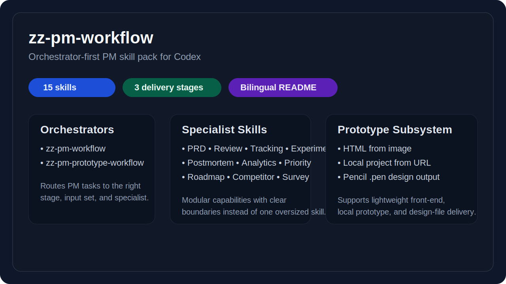
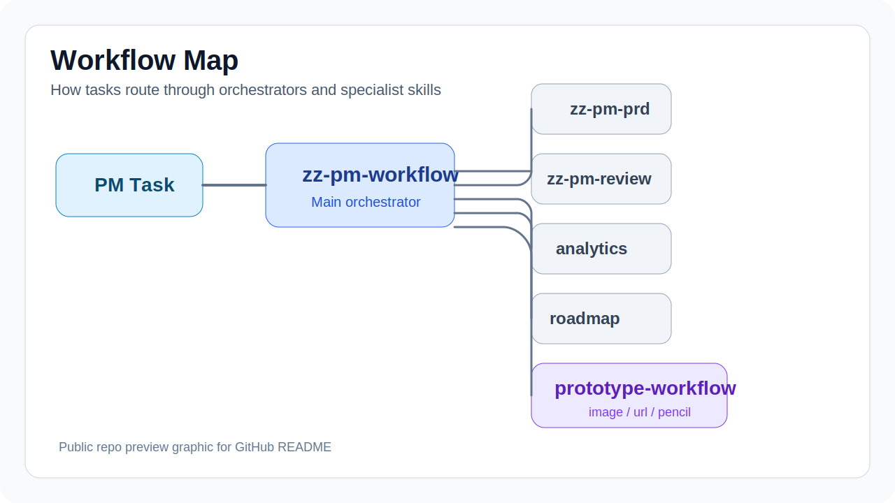
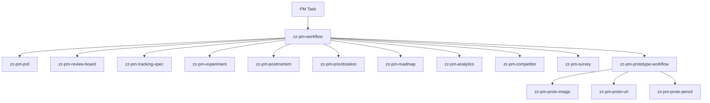

# zz-pm-workflow

> Product management skill pack with an orchestrator-first architecture.  
> 一套以总控技能为核心的产品管理技能包。

> Codex product management skill pack for PRDs, review, analytics, roadmap planning, and prototype workflows.  
> 面向 Codex 的产品管理技能包，覆盖 PRD、评审、数据分析、路线图规划与原型工作流。


| Pack Overview | Workflow Map |
|---|---|
|  |  |

## Quick Nav

- [中文说明](#中文说明)
- [English](#english)
- [Skill Map](#skill-map)
- [Routing Model](#routing-model)
- [Repository Structure](#repository-structure)
- [Repository Links](#repository-links)

---

## 中文说明

<details open>
<summary><strong>展开中文</strong></summary>

### 定位

`zz-pm-workflow` 是一套面向产品工作的模块化技能包。它把产品任务拆成：

- 总控技能
- 专项技能
- 原型子系统

这样做的目标是让不同类型的产品任务进入清晰、稳定、可扩展的处理路径，而不是依赖一个“大而全”的单一 Skill。

### 设计原则

| 原则 | 说明 |
|---|---|
| 总控优先 | 所有产品任务先进入 [`zz-pm-workflow`](./.codex/skills/zz-pm-workflow/SKILL.md)，先判断任务类型、阶段和输入优先级 |
| 专项单责 | 每个子技能只负责一个明确能力域，避免边界漂移 |
| 规范优先 | 进入具体项目时，优先读取项目规则、SOP、`DESIGN.md`、设计规范和原型规范 |
| 原型分层 | 原型任务先进入 [`zz-pm-prototype-workflow`](./.codex/skills/zz-pm-prototype-workflow/SKILL.md)，再分流到不同交付链路 |

### 技能地图

#### 1. 总控层

| Skill | 作用 | 可以做什么 | 典型场景 |
|---|---|---|---|
| [`zz-pm-workflow`](./.codex/skills/zz-pm-workflow/SKILL.md) | 产品任务总入口 | 判断任务类型、阶段、规范优先级，并路由到正确子技能 | 当你只知道要推进一个产品任务，但还没想清楚应该先做什么时会触发。<br>当你需要判断应该先看 PRD、原型、设计规范还是评审材料时会触发。<br>当你想让系统先分流到正确子技能，而不是直接开始产出时会触发。 |
| [`zz-pm-prototype-workflow`](./.codex/skills/zz-pm-prototype-workflow/SKILL.md) | 原型任务总入口 | 判断原型应走 HTML、工程原型还是 `.pen` 设计稿 | 当你说“帮我做个原型”但还没确定交付形式时会触发。<br>当你手里可能有截图、URL 或设计稿，但不知道该走哪条原型链路时会触发。<br>当你需要先判断做 HTML、工程原型还是 `.pen` 设计稿时会触发。 |

#### 2. 文档与评审

| Skill | 作用 | 可以做什么 | 典型场景 |
|---|---|---|---|
| [`zz-pm-prd`](./.codex/skills/zz-pm-prd/SKILL.md) | PRD 文档生成 | 基于原型、截图、规则和样例输出初评版或正式版 PRD | 当你已经有原型、截图或页面方案，准备把它写成正式需求文档时会触发。<br>当你需要先出初评版 PRD，再收敛成正式版时会触发。<br>当你明确要求“按目录写 PRD”或“生成正式版需求文档”时会触发。 |
| [`zz-pm-review-board`](./.codex/skills/zz-pm-review-board/SKILL.md) | 多角色评审 | 从产品、研发、测试、设计、运营、合规视角查漏补缺 | 当你准备开评审会，想先检查方案是否有明显缺口时会触发。<br>当你想从研发、测试、设计或运营多个视角一起看风险时会触发。<br>当你明确要求“帮我 review 一下”或“这个方案能不能过评审”时会触发。 |

#### 3. 数据与验证

| Skill | 作用 | 可以做什么 | 典型场景 |
|---|---|---|---|
| [`zz-pm-tracking-spec`](./.codex/skills/zz-pm-tracking-spec/SKILL.md) | 埋点方案设计 | 设计事件、字段、指标口径和 QA 验收清单 | 当你已经有功能流程，下一步要定义事件和字段时会触发。<br>当你要把业务目标翻译成可执行的 tracking spec 时会触发。<br>当你明确问“这个功能怎么埋点”或“怎么定义指标口径”时会触发。 |
| [`zz-pm-experiment`](./.codex/skills/zz-pm-experiment/SKILL.md) | A/B 实验设计 | 设计实验假设、分流方式、护栏指标、样本量和止损规则 | 当你在纠结某个改动要不要通过 A/B 实验验证时会触发。<br>当你需要设计分组、指标、样本量和判定标准时会触发。<br>当你明确说“帮我做 A/B 实验”或“算一下样本量”时会触发。 |
| [`zz-pm-postmortem`](./.codex/skills/zz-pm-postmortem/SKILL.md) | 复盘与改进行动 | 对版本、上线或事故做复盘，输出归因和行动项 | 当一个版本、项目或上线已经结束，需要系统复盘时会触发。<br>当你要把结果、问题和经验沉淀成后续行动项时会触发。<br>当你明确说“写复盘”“做 RCA”或“整理 postmortem”时会触发。 |
| [`zz-pm-analytics`](./.codex/skills/zz-pm-analytics/SKILL.md) | 数据分析与洞察 | 对漏斗、留存、分群和指标异常做分析，产出洞察与建议 | 当你发现某个核心指标异常变化，想知道原因时会触发。<br>当你需要分析漏斗、留存、分群或实验结果并给出动作建议时会触发。<br>当你明确问“这个指标为什么跌了”或“帮我做留存分析”时会触发。 |

#### 4. 决策与规划

| Skill | 作用 | 可以做什么 | 典型场景 |
|---|---|---|---|
| [`zz-pm-prioritization`](./.codex/skills/zz-pm-prioritization/SKILL.md) | 优先级排序 | 用 RICE / ICE / Kano / 成本收益做排序与取舍 | 当你手里有多个需求或项目候选项，需要决定先做谁时会触发。<br>当你希望用 RICE、ICE、Kano 或成本收益方法做取舍时会触发。<br>当你明确问“这些需求先做哪个”或“资源有限该砍哪些”时会触发。 |
| [`zz-pm-roadmap`](./.codex/skills/zz-pm-roadmap/SKILL.md) | 路线图规划 | 把目标、产能和依赖编排成版本路线图和里程碑 | 当你已经大致知道要做哪些项，下一步要排版本节奏时会触发。<br>当你需要梳理里程碑、依赖关系和交付节奏时会触发。<br>当你明确说“帮我做 roadmap”或“排季度计划”时会触发。 |
| [`zz-pm-competitor`](./.codex/skills/zz-pm-competitor/SKILL.md) | 竞品拆解 | 对比策略、功能、体验、增长，并给出差异化建议 | 当你需要理解竞品在策略、功能和体验上的差异时会触发。<br>当你想知道哪些点可以借鉴、哪些点不该照抄时会触发。<br>当你明确说“帮我做竞品分析”或“做对标分析”时会触发。 |
| [`zz-pm-survey`](./.codex/skills/zz-pm-survey/SKILL.md) | 问卷设计 | 根据调研目标设计问卷、审查偏差并给发放建议 | 当你已经有调研目标，下一步要把它变成可发放问卷时会触发。<br>当你需要检查题目是否有偏差、样本是否合理时会触发。<br>当你明确说“帮我设计问卷”或“做个 NPS 调查”时会触发。 |

#### 5. 原型子系统

| Skill | 作用 | 可以做什么 | 典型场景 |
|---|---|---|---|
| [`zz-pm-proto-image`](./.codex/skills/zz-pm-proto-image/SKILL.md) | 截图到 HTML 原型 | 根据截图、设计稿或标注图复刻 HTML 原型 | 当你只有截图或设计稿，想快速做一个可预览页面时会触发。<br>当你要复刻弹窗、表单、列表或单页界面时会触发。<br>当你明确说“照这个图做页面”或“根据截图出 HTML”时会触发。 |
| [`zz-pm-proto-url`](./.codex/skills/zz-pm-proto-url/SKILL.md) | URL 到本地原型工程 | 根据 URL 或在线页面复刻成本地可运行的原型工程 | 当你有一个现成网站或在线页面，想把它复刻成本地工程时会触发。<br>当你不只要静态页面，还需要后续继续改造和扩展时会触发。<br>当你明确说“克隆这个网站做原型”或“做成可运行工程”时会触发。 |
| [`zz-pm-proto-pencil`](./.codex/skills/zz-pm-proto-pencil/SKILL.md) | 截图到 `.pen` 设计稿 | 根据截图或参考图输出 `.pen` 设计稿和说明 | 当你明确要交付 `.pen` 或 Pencil 设计稿时会触发。<br>当你需要面向设计评审或规范资产输出可视化画板时会触发。<br>当你明确说“根据这张图做 .pen”或“输出设计图和说明”时会触发。 |

### 路由模型



简化理解：

1. 所有产品任务先进入 [`zz-pm-workflow`](./.codex/skills/zz-pm-workflow/SKILL.md)
2. 文档任务切到 [`zz-pm-prd`](./.codex/skills/zz-pm-prd/SKILL.md)
3. 原型任务切到 [`zz-pm-prototype-workflow`](./.codex/skills/zz-pm-prototype-workflow/SKILL.md)
4. 原型子系统再分流到 `image / url / pencil`
5. 其余任务按能力域切到对应专项技能

### 当前状态

| 项目 | 状态 |
|---|---|
| 第一阶段核心技能 | 已完成 |
| 第二阶段策略与分析技能 | 已完成 |
| 第三阶段原型子系统 | 已完成 |
| 已落地技能数 | 15 |

</details>

---

## English

<details>
<summary><strong>Expand English</strong></summary>

### Positioning

`zz-pm-workflow` is a modular PM skill pack built around an orchestrator-first architecture.

Instead of one oversized PM skill, this pack separates work into:

- orchestrators
- specialist skills
- a dedicated prototype subsystem

The goal is clearer routing, clearer ownership, and better reuse across projects.

### Design Principles

| Principle | Meaning |
|---|---|
| Orchestrator first | All PM tasks enter [`zz-pm-workflow`](./.codex/skills/zz-pm-workflow/SKILL.md) first |
| Single responsibility | Each specialist skill owns one capability domain |
| Project rules first | In real projects, prefer project `AGENTS.md`, `SOP`, `DESIGN.md`, design spec, and prototype spec |
| Layered prototyping | Prototype tasks first route to [`zz-pm-prototype-workflow`](./.codex/skills/zz-pm-prototype-workflow/SKILL.md), then to `image / url / pencil` |

### Skill Map

#### 1. Orchestrators

| Skill | Responsibility | What it can do | Typical use case |
|---|---|---|---|
| [`zz-pm-workflow`](./.codex/skills/zz-pm-workflow/SKILL.md) | Main PM entry point | classify PM tasks, decide stage and input priority, then route to the right specialist | Trigger this when you know you need help on a PM task but do not know the right workflow yet.<br>Trigger this when you need to decide whether to start from PRD, prototype, review, or planning materials.<br>Trigger this when you want the system to route work before producing the final deliverable. |
| [`zz-pm-prototype-workflow`](./.codex/skills/zz-pm-prototype-workflow/SKILL.md) | Main prototype entry point | decide whether prototype work should become HTML, a local project, or a `.pen` file | Trigger this when you need a prototype but have not chosen the output format yet.<br>Trigger this when you have screenshots, URLs, or design references but do not know which prototype path fits best.<br>Trigger this when you need to decide between HTML, local project, or `.pen` delivery. |

#### 2. Docs and Review

| Skill | Responsibility | What it can do | Typical use case |
|---|---|---|---|
| [`zz-pm-prd`](./.codex/skills/zz-pm-prd/SKILL.md) | PRD generation | generate review-ready or final PRDs from prototypes, screenshots, rules, and examples | Trigger this when you already have a prototype or page plan and need to turn it into a requirement document.<br>Trigger this when you want to move from a review draft to a final PRD.<br>Trigger this when the request is explicitly “write a PRD” or “generate the final requirement doc.” |
| [`zz-pm-review-board`](./.codex/skills/zz-pm-review-board/SKILL.md) | Multi-role review | run PM review passes across product, engineering, QA, design, ops, and compliance | Trigger this when you want to check whether a proposal is ready for formal review.<br>Trigger this when you need product, engineering, QA, design, or ops feedback in one pass.<br>Trigger this when the request is explicitly “review this plan” or “can this pass review?” |

#### 3. Data and Validation

| Skill | Responsibility | What it can do | Typical use case |
|---|---|---|---|
| [`zz-pm-tracking-spec`](./.codex/skills/zz-pm-tracking-spec/SKILL.md) | Tracking design | define events, fields, metric definitions, and QA checks | Trigger this when you already know the user flow and need event or field definitions.<br>Trigger this when you need to translate business goals into a concrete tracking spec.<br>Trigger this when the request is explicitly “how should we track this feature?” |
| [`zz-pm-experiment`](./.codex/skills/zz-pm-experiment/SKILL.md) | Experiment design | design hypotheses, groups, guardrails, sample size, and decision rules | Trigger this when you need to validate a product change with an A/B test instead of shipping blindly.<br>Trigger this when you need groups, metrics, sample sizing, or decision rules for an experiment.<br>Trigger this when the request is explicitly “design an A/B test” or “estimate sample size.” |
| [`zz-pm-postmortem`](./.codex/skills/zz-pm-postmortem/SKILL.md) | Postmortem | create structured postmortems for launches, projects, or incidents | Trigger this when a launch, project, or incident has already happened and needs structured review.<br>Trigger this when you need to turn outcomes, issues, and lessons into follow-up actions.<br>Trigger this when the request is explicitly “write a postmortem” or “do RCA.” |
| [`zz-pm-analytics`](./.codex/skills/zz-pm-analytics/SKILL.md) | Analytics | analyze funnels, retention, segmentation, and metric anomalies | Trigger this when a key metric changes and you need to understand why.<br>Trigger this when you need analysis on funnels, retention, segmentation, or experiment outcomes with action recommendations.<br>Trigger this when the request is explicitly “why did this metric drop?” or “analyze retention.” |

#### 4. Decision and Planning

| Skill | Responsibility | What it can do | Typical use case |
|---|---|---|---|
| [`zz-pm-prioritization`](./.codex/skills/zz-pm-prioritization/SKILL.md) | Prioritization | rank ideas with RICE, ICE, Kano, and tradeoff logic | Trigger this when you have multiple candidate initiatives and need to decide what goes first.<br>Trigger this when you want to apply RICE, ICE, Kano, or cost-benefit logic to real tradeoffs.<br>Trigger this when the request is explicitly “which ideas should go first?” |
| [`zz-pm-roadmap`](./.codex/skills/zz-pm-roadmap/SKILL.md) | Roadmap planning | turn goals and constraints into milestones and sequencing | Trigger this when the candidate work is mostly known and you need sequencing rather than prioritization.<br>Trigger this when you need milestones, dependencies, and delivery rhythm for a quarter or release plan.<br>Trigger this when the request is explicitly “build a roadmap” or “plan the quarter.” |
| [`zz-pm-competitor`](./.codex/skills/zz-pm-competitor/SKILL.md) | Competitor teardown | analyze competitors and suggest differentiation | Trigger this when you need to compare competitors across strategy, features, experience, or growth.<br>Trigger this when you want to identify what to borrow, what to avoid, and where to differentiate.<br>Trigger this when the request is explicitly “do competitor analysis.” |
| [`zz-pm-survey`](./.codex/skills/zz-pm-survey/SKILL.md) | Survey design | design research surveys and review question quality | Trigger this when you already know the research goal and need a survey that can be sent out.<br>Trigger this when you need help checking question bias, sample quality, or distribution logic.<br>Trigger this when the request is explicitly “design a survey” or “draft an NPS questionnaire.” |

#### 5. Prototype Subsystem

| Skill | Responsibility | What it can do | Typical use case |
|---|---|---|---|
| [`zz-pm-proto-image`](./.codex/skills/zz-pm-proto-image/SKILL.md) | Screenshot to HTML prototype | recreate screenshots as HTML prototypes | Trigger this when you only have screenshots or mockups and need a fast previewable page.<br>Trigger this when you want to recreate a modal, form, table, or single screen as HTML.<br>Trigger this when the request is explicitly “turn this screenshot into a page.” |
| [`zz-pm-proto-url`](./.codex/skills/zz-pm-proto-url/SKILL.md) | URL to local prototype | recreate live pages as local runnable prototype projects | Trigger this when you have a live site or reference URL and want a local runnable prototype.<br>Trigger this when you need more than a static page and want room for continued iteration in code.<br>Trigger this when the request is explicitly “clone this website into a local prototype.” |
| [`zz-pm-proto-pencil`](./.codex/skills/zz-pm-proto-pencil/SKILL.md) | Screenshot to `.pen` | recreate screenshots as `.pen` design files with notes | Trigger this when the deliverable must be a Pencil or `.pen` design file.<br>Trigger this when the output is meant for design review, canvas assets, or design-spec handoff.<br>Trigger this when the request is explicitly “turn this image into a Pencil design file.” |

### Routing Model

Default routing:

1. all PM tasks enter [`zz-pm-workflow`](./.codex/skills/zz-pm-workflow/SKILL.md)
2. document tasks route to [`zz-pm-prd`](./.codex/skills/zz-pm-prd/SKILL.md)
3. prototype tasks route to [`zz-pm-prototype-workflow`](./.codex/skills/zz-pm-prototype-workflow/SKILL.md)
4. prototype workflow then routes to `image / url / pencil`
5. all other tasks route by capability domain

### Current Status

| Item | Status |
|---|---|
| Phase 1 core skills | done |
| Phase 2 strategy and analysis skills | done |
| Phase 3 prototype subsystem | done |
| Implemented skills | 15 |

</details>

---

## Skill Map

| Group | Skills |
|---|---|
| Orchestrators | [`zz-pm-workflow`](./.codex/skills/zz-pm-workflow/SKILL.md), [`zz-pm-prototype-workflow`](./.codex/skills/zz-pm-prototype-workflow/SKILL.md) |
| Docs & Review | [`zz-pm-prd`](./.codex/skills/zz-pm-prd/SKILL.md), [`zz-pm-review-board`](./.codex/skills/zz-pm-review-board/SKILL.md) |
| Data & Validation | [`zz-pm-tracking-spec`](./.codex/skills/zz-pm-tracking-spec/SKILL.md), [`zz-pm-experiment`](./.codex/skills/zz-pm-experiment/SKILL.md), [`zz-pm-postmortem`](./.codex/skills/zz-pm-postmortem/SKILL.md), [`zz-pm-analytics`](./.codex/skills/zz-pm-analytics/SKILL.md) |
| Decision & Planning | [`zz-pm-prioritization`](./.codex/skills/zz-pm-prioritization/SKILL.md), [`zz-pm-roadmap`](./.codex/skills/zz-pm-roadmap/SKILL.md), [`zz-pm-competitor`](./.codex/skills/zz-pm-competitor/SKILL.md), [`zz-pm-survey`](./.codex/skills/zz-pm-survey/SKILL.md) |
| Prototype Subsystem | [`zz-pm-proto-image`](./.codex/skills/zz-pm-proto-image/SKILL.md), [`zz-pm-proto-url`](./.codex/skills/zz-pm-proto-url/SKILL.md), [`zz-pm-proto-pencil`](./.codex/skills/zz-pm-proto-pencil/SKILL.md) |

## Routing Model

`PM task` -> [`zz-pm-workflow`](./.codex/skills/zz-pm-workflow/SKILL.md) -> specialist skill  
`Prototype task` -> [`zz-pm-prototype-workflow`](./.codex/skills/zz-pm-prototype-workflow/SKILL.md) -> `image / url / pencil`

## Repository Structure

```text
zz-pm-workflow/
├── README.md
├── CONTRIBUTING.md
├── .gitignore
├── AGENTS.md
└── .codex/
    └── skills/
        ├── zz-pm-workflow/
        │   └── SKILL.md
        ├── zz-pm-prototype-workflow/
        │   └── SKILL.md
        ├── zz-pm-prd/
        │   ├── SKILL.md
        │   └── README.md
        ├── zz-pm-review-board/
        │   └── SKILL.md
        ├── zz-pm-tracking-spec/
        │   └── SKILL.md
        ├── zz-pm-experiment/
        │   └── SKILL.md
        ├── zz-pm-postmortem/
        │   └── SKILL.md
        ├── zz-pm-prioritization/
        │   └── SKILL.md
        ├── zz-pm-roadmap/
        │   └── SKILL.md
        ├── zz-pm-analytics/
        │   └── SKILL.md
        ├── zz-pm-competitor/
        │   └── SKILL.md
        ├── zz-pm-survey/
        │   └── SKILL.md
        ├── zz-pm-proto-image/
        │   └── SKILL.md
        ├── zz-pm-proto-url/
        │   └── SKILL.md
        └── zz-pm-proto-pencil/
            └── SKILL.md
```

| Path | Purpose |
|---|---|
| [`README.md`](./README.md) | Public-facing overview, skill map, routing model, and navigation |
| [`CONTRIBUTING.md`](./CONTRIBUTING.md) | Contribution and maintenance guidelines for the pack |
| [`AGENTS.md`](./AGENTS.md) | Local routing rules for Codex when this pack is used as a workspace |
| [`.codex/skills/`](./.codex/skills/) | All orchestrators and specialist skills |
| [`zz-pm-prd/README.md`](./.codex/skills/zz-pm-prd/README.md) | Extra notes for the PRD skill where a skill needs supplemental documentation |

## Repository Links

- [Orchestrator: `zz-pm-workflow`](./.codex/skills/zz-pm-workflow/SKILL.md)
- [Orchestrator: `zz-pm-prototype-workflow`](./.codex/skills/zz-pm-prototype-workflow/SKILL.md)
- [PRD](./.codex/skills/zz-pm-prd/SKILL.md)
- [Review Board](./.codex/skills/zz-pm-review-board/SKILL.md)
- [Tracking Spec](./.codex/skills/zz-pm-tracking-spec/SKILL.md)
- [Experiment](./.codex/skills/zz-pm-experiment/SKILL.md)
- [Postmortem](./.codex/skills/zz-pm-postmortem/SKILL.md)
- [Prioritization](./.codex/skills/zz-pm-prioritization/SKILL.md)
- [Roadmap](./.codex/skills/zz-pm-roadmap/SKILL.md)
- [Analytics](./.codex/skills/zz-pm-analytics/SKILL.md)
- [Competitor](./.codex/skills/zz-pm-competitor/SKILL.md)
- [Survey](./.codex/skills/zz-pm-survey/SKILL.md)
- [Prototype Image](./.codex/skills/zz-pm-proto-image/SKILL.md)
- [Prototype URL](./.codex/skills/zz-pm-proto-url/SKILL.md)
- [Prototype Pencil](./.codex/skills/zz-pm-proto-pencil/SKILL.md)
