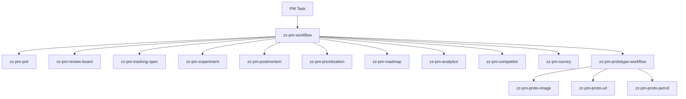

# zz-pm-workflow

> Product management skill pack with an orchestrator-first architecture.  
> 一套以总控技能为核心的产品管理技能包。


## Quick Nav

- [中文说明](#中文说明)
- [English](#english)
- [Skill Map](#skill-map)
- [Routing Model](#routing-model)
- [Repository Structure](#repository-structure)
- [Repository Links](#repository-links)

---

## 中文说明

<details open>
<summary><strong>展开中文</strong></summary>

### 定位

`zz-pm-workflow` 是一套面向产品工作的模块化技能包。它把产品任务拆成：

- 总控技能
- 专项技能
- 原型子系统

这样做的目标是让不同类型的产品任务进入清晰、稳定、可扩展的处理路径，而不是依赖一个“大而全”的单一 Skill。

### 设计原则

| 原则 | 说明 |
|---|---|
| 总控优先 | 所有产品任务先进入 [`zz-pm-workflow`](./.codex/skills/zz-pm-workflow/SKILL.md)，先判断任务类型、阶段和输入优先级 |
| 专项单责 | 每个子技能只负责一个明确能力域，避免边界漂移 |
| 规范优先 | 进入具体项目时，优先读取项目规则、SOP、`DESIGN.md`、设计规范和原型规范 |
| 原型分层 | 原型任务先进入 [`zz-pm-prototype-workflow`](./.codex/skills/zz-pm-prototype-workflow/SKILL.md)，再分流到不同交付链路 |

### 技能地图

#### 1. 总控层

| Skill | 作用 | 可以做什么 | 典型场景 |
|---|---|---|---|
| [`zz-pm-workflow`](./.codex/skills/zz-pm-workflow/SKILL.md) | 产品任务总入口 | 判断任务类型、阶段、规范优先级，并路由到正确子技能 | “这个产品任务下一步该怎么走？” |
| [`zz-pm-prototype-workflow`](./.codex/skills/zz-pm-prototype-workflow/SKILL.md) | 原型任务总入口 | 判断原型应走 HTML、工程原型还是 `.pen` 设计稿 | “帮我做原型，但我还没确定交付形式” |

#### 2. 文档与评审

| Skill | 作用 | 可以做什么 | 典型场景 |
|---|---|---|---|
| [`zz-pm-prd`](./.codex/skills/zz-pm-prd/SKILL.md) | PRD 文档生成 | 基于原型、截图、规则和样例输出初评版或正式版 PRD | “按目录写 PRD”“生成正式版需求文档” |
| [`zz-pm-review-board`](./.codex/skills/zz-pm-review-board/SKILL.md) | 多角色评审 | 从产品、研发、测试、设计、运营、合规视角查漏补缺 | “这个方案能不能过评审”“帮我 review 一下” |

#### 3. 数据与验证

| Skill | 作用 | 可以做什么 | 典型场景 |
|---|---|---|---|
| [`zz-pm-tracking-spec`](./.codex/skills/zz-pm-tracking-spec/SKILL.md) | 埋点方案设计 | 设计事件、字段、指标口径和 QA 验收清单 | “这个功能怎么埋点？” |
| [`zz-pm-experiment`](./.codex/skills/zz-pm-experiment/SKILL.md) | A/B 实验设计 | 设计实验假设、分流方式、护栏指标、样本量和止损规则 | “帮我做 A/B 实验”“算一下样本量” |
| [`zz-pm-postmortem`](./.codex/skills/zz-pm-postmortem/SKILL.md) | 复盘与改进行动 | 对版本、上线或事故做复盘，输出归因和行动项 | “写复盘”“做 RCA” |
| [`zz-pm-analytics`](./.codex/skills/zz-pm-analytics/SKILL.md) | 数据分析与洞察 | 对漏斗、留存、分群和指标异常做分析，产出洞察与建议 | “这个指标为什么跌了？” |

#### 4. 决策与规划

| Skill | 作用 | 可以做什么 | 典型场景 |
|---|---|---|---|
| [`zz-pm-prioritization`](./.codex/skills/zz-pm-prioritization/SKILL.md) | 优先级排序 | 用 RICE / ICE / Kano / 成本收益做排序与取舍 | “这些需求先做哪个？” |
| [`zz-pm-roadmap`](./.codex/skills/zz-pm-roadmap/SKILL.md) | 路线图规划 | 把目标、产能和依赖编排成版本路线图和里程碑 | “帮我做 roadmap”“排季度计划” |
| [`zz-pm-competitor`](./.codex/skills/zz-pm-competitor/SKILL.md) | 竞品拆解 | 对比策略、功能、体验、增长，并给出差异化建议 | “帮我做竞品分析” |
| [`zz-pm-survey`](./.codex/skills/zz-pm-survey/SKILL.md) | 问卷设计 | 根据调研目标设计问卷、审查偏差并给发放建议 | “帮我设计问卷”“做个用户调研” |

#### 5. 原型子系统

| Skill | 作用 | 可以做什么 | 典型场景 |
|---|---|---|---|
| [`zz-pm-proto-image`](./.codex/skills/zz-pm-proto-image/SKILL.md) | 截图到 HTML 原型 | 根据截图、设计稿或标注图复刻 HTML 原型 | “照这个图做页面” |
| [`zz-pm-proto-url`](./.codex/skills/zz-pm-proto-url/SKILL.md) | URL 到本地原型工程 | 根据 URL 或在线页面复刻成本地可运行的原型工程 | “克隆这个网站做原型” |
| [`zz-pm-proto-pencil`](./.codex/skills/zz-pm-proto-pencil/SKILL.md) | 截图到 `.pen` 设计稿 | 根据截图或参考图输出 `.pen` 设计稿和说明 | “根据这张图做 .pen” |

### 路由模型



简化理解：

1. 所有产品任务先进入 [`zz-pm-workflow`](./.codex/skills/zz-pm-workflow/SKILL.md)
2. 文档任务切到 [`zz-pm-prd`](./.codex/skills/zz-pm-prd/SKILL.md)
3. 原型任务切到 [`zz-pm-prototype-workflow`](./.codex/skills/zz-pm-prototype-workflow/SKILL.md)
4. 原型子系统再分流到 `image / url / pencil`
5. 其余任务按能力域切到对应专项技能

### 当前状态

| 项目 | 状态 |
|---|---|
| 第一阶段核心技能 | 已完成 |
| 第二阶段策略与分析技能 | 已完成 |
| 第三阶段原型子系统 | 已完成 |
| 已落地技能数 | 15 |

### 参考来源

| 来源 | 对应能力 |
|---|---|
| `pm-review-board` | 评审 |
| `pm-tracking-spec-writer` | 埋点 |
| `pm-postmortem-writer` | 复盘 |
| `pm-experiment-designer` | 实验设计 |
| `pm-prioritization-engine` | 优先级 |
| `pm-roadmap-planner` | 路线图 |
| `pm-analytics` | 数据分析 |
| `pm-competitor-deconstructor` | 竞品 |
| `pm-survey-designer` | 问卷 |
| `pm-image2proto` | 截图原型 |
| `pm-image2pencil` | `.pen` 设计稿 |
| `pm-url2proto` | URL 原型工程 |

</details>

---

## English

<details>
<summary><strong>Expand English</strong></summary>

### Positioning

`zz-pm-workflow` is a modular PM skill pack built around an orchestrator-first architecture.

Instead of one oversized PM skill, this pack separates work into:

- orchestrators
- specialist skills
- a dedicated prototype subsystem

The goal is clearer routing, clearer ownership, and better reuse across projects.

### Design Principles

| Principle | Meaning |
|---|---|
| Orchestrator first | All PM tasks enter [`zz-pm-workflow`](./.codex/skills/zz-pm-workflow/SKILL.md) first |
| Single responsibility | Each specialist skill owns one capability domain |
| Project rules first | In real projects, prefer project `AGENTS.md`, `SOP`, `DESIGN.md`, design spec, and prototype spec |
| Layered prototyping | Prototype tasks first route to [`zz-pm-prototype-workflow`](./.codex/skills/zz-pm-prototype-workflow/SKILL.md), then to `image / url / pencil` |

### Skill Map

#### 1. Orchestrators

| Skill | Responsibility | What it can do | Typical use case |
|---|---|---|---|
| [`zz-pm-workflow`](./.codex/skills/zz-pm-workflow/SKILL.md) | Main PM entry point | classify PM tasks, decide stage and input priority, then route to the right specialist | “what should this PM task do next?” |
| [`zz-pm-prototype-workflow`](./.codex/skills/zz-pm-prototype-workflow/SKILL.md) | Main prototype entry point | decide whether prototype work should become HTML, a local project, or a `.pen` file | “I need a prototype but I have not picked the output format yet” |

#### 2. Docs and Review

| Skill | Responsibility | What it can do | Typical use case |
|---|---|---|---|
| [`zz-pm-prd`](./.codex/skills/zz-pm-prd/SKILL.md) | PRD generation | generate review-ready or final PRDs from prototypes, screenshots, rules, and examples | “write a PRD”, “generate the final requirement doc” |
| [`zz-pm-review-board`](./.codex/skills/zz-pm-review-board/SKILL.md) | Multi-role review | run PM review passes across product, engineering, QA, design, ops, and compliance | “can this pass review?”, “review this plan” |

#### 3. Data and Validation

| Skill | Responsibility | What it can do | Typical use case |
|---|---|---|---|
| [`zz-pm-tracking-spec`](./.codex/skills/zz-pm-tracking-spec/SKILL.md) | Tracking design | define events, fields, metric definitions, and QA checks | “how should we track this feature?” |
| [`zz-pm-experiment`](./.codex/skills/zz-pm-experiment/SKILL.md) | Experiment design | design hypotheses, groups, guardrails, sample size, and decision rules | “design an A/B test”, “estimate sample size” |
| [`zz-pm-postmortem`](./.codex/skills/zz-pm-postmortem/SKILL.md) | Postmortem | create structured postmortems for launches, projects, or incidents | “write a postmortem”, “do RCA” |
| [`zz-pm-analytics`](./.codex/skills/zz-pm-analytics/SKILL.md) | Analytics | analyze funnels, retention, segmentation, and metric anomalies | “why did this metric drop?”, “analyze retention” |

#### 4. Decision and Planning

| Skill | Responsibility | What it can do | Typical use case |
|---|---|---|---|
| [`zz-pm-prioritization`](./.codex/skills/zz-pm-prioritization/SKILL.md) | Prioritization | rank ideas with RICE, ICE, Kano, and tradeoff logic | “which ideas should go first?” |
| [`zz-pm-roadmap`](./.codex/skills/zz-pm-roadmap/SKILL.md) | Roadmap planning | turn goals and constraints into milestones and sequencing | “build a roadmap”, “plan the quarter” |
| [`zz-pm-competitor`](./.codex/skills/zz-pm-competitor/SKILL.md) | Competitor teardown | analyze competitors and suggest differentiation | “do competitor analysis” |
| [`zz-pm-survey`](./.codex/skills/zz-pm-survey/SKILL.md) | Survey design | design research surveys and review question quality | “design a survey”, “draft an NPS questionnaire” |

#### 5. Prototype Subsystem

| Skill | Responsibility | What it can do | Typical use case |
|---|---|---|---|
| [`zz-pm-proto-image`](./.codex/skills/zz-pm-proto-image/SKILL.md) | Screenshot to HTML prototype | recreate screenshots as HTML prototypes | “turn this screenshot into a page” |
| [`zz-pm-proto-url`](./.codex/skills/zz-pm-proto-url/SKILL.md) | URL to local prototype | recreate live pages as local runnable prototype projects | “clone this website into a local prototype” |
| [`zz-pm-proto-pencil`](./.codex/skills/zz-pm-proto-pencil/SKILL.md) | Screenshot to `.pen` | recreate screenshots as `.pen` design files with notes | “turn this image into a Pencil design file” |

### Routing Model

Default routing:

1. all PM tasks enter [`zz-pm-workflow`](./.codex/skills/zz-pm-workflow/SKILL.md)
2. document tasks route to [`zz-pm-prd`](./.codex/skills/zz-pm-prd/SKILL.md)
3. prototype tasks route to [`zz-pm-prototype-workflow`](./.codex/skills/zz-pm-prototype-workflow/SKILL.md)
4. prototype workflow then routes to `image / url / pencil`
5. all other tasks route by capability domain

### Current Status

| Item | Status |
|---|---|
| Phase 1 core skills | done |
| Phase 2 strategy and analysis skills | done |
| Phase 3 prototype subsystem | done |
| Implemented skills | 15 |

### Source Skills

This pack adapts capability boundaries from:

- `pm-review-board`
- `pm-tracking-spec-writer`
- `pm-postmortem-writer`
- `pm-experiment-designer`
- `pm-prioritization-engine`
- `pm-roadmap-planner`
- `pm-analytics`
- `pm-competitor-deconstructor`
- `pm-survey-designer`
- `pm-image2proto`
- `pm-image2pencil`
- `pm-url2proto`

</details>

---

## Skill Map

| Group | Skills |
|---|---|
| Orchestrators | [`zz-pm-workflow`](./.codex/skills/zz-pm-workflow/SKILL.md), [`zz-pm-prototype-workflow`](./.codex/skills/zz-pm-prototype-workflow/SKILL.md) |
| Docs & Review | [`zz-pm-prd`](./.codex/skills/zz-pm-prd/SKILL.md), [`zz-pm-review-board`](./.codex/skills/zz-pm-review-board/SKILL.md) |
| Data & Validation | [`zz-pm-tracking-spec`](./.codex/skills/zz-pm-tracking-spec/SKILL.md), [`zz-pm-experiment`](./.codex/skills/zz-pm-experiment/SKILL.md), [`zz-pm-postmortem`](./.codex/skills/zz-pm-postmortem/SKILL.md), [`zz-pm-analytics`](./.codex/skills/zz-pm-analytics/SKILL.md) |
| Decision & Planning | [`zz-pm-prioritization`](./.codex/skills/zz-pm-prioritization/SKILL.md), [`zz-pm-roadmap`](./.codex/skills/zz-pm-roadmap/SKILL.md), [`zz-pm-competitor`](./.codex/skills/zz-pm-competitor/SKILL.md), [`zz-pm-survey`](./.codex/skills/zz-pm-survey/SKILL.md) |
| Prototype Subsystem | [`zz-pm-proto-image`](./.codex/skills/zz-pm-proto-image/SKILL.md), [`zz-pm-proto-url`](./.codex/skills/zz-pm-proto-url/SKILL.md), [`zz-pm-proto-pencil`](./.codex/skills/zz-pm-proto-pencil/SKILL.md) |

## Routing Model

`PM task` -> [`zz-pm-workflow`](./.codex/skills/zz-pm-workflow/SKILL.md) -> specialist skill  
`Prototype task` -> [`zz-pm-prototype-workflow`](./.codex/skills/zz-pm-prototype-workflow/SKILL.md) -> `image / url / pencil`

## Repository Structure

```text
zz-pm-workflow/
├── README.md
├── CONTRIBUTING.md
├── .gitignore
├── AGENTS.md
└── .codex/
    └── skills/
        ├── zz-pm-workflow/
        │   └── SKILL.md
        ├── zz-pm-prototype-workflow/
        │   └── SKILL.md
        ├── zz-pm-prd/
        │   ├── SKILL.md
        │   └── README.md
        ├── zz-pm-review-board/
        │   └── SKILL.md
        ├── zz-pm-tracking-spec/
        │   └── SKILL.md
        ├── zz-pm-experiment/
        │   └── SKILL.md
        ├── zz-pm-postmortem/
        │   └── SKILL.md
        ├── zz-pm-prioritization/
        │   └── SKILL.md
        ├── zz-pm-roadmap/
        │   └── SKILL.md
        ├── zz-pm-analytics/
        │   └── SKILL.md
        ├── zz-pm-competitor/
        │   └── SKILL.md
        ├── zz-pm-survey/
        │   └── SKILL.md
        ├── zz-pm-proto-image/
        │   └── SKILL.md
        ├── zz-pm-proto-url/
        │   └── SKILL.md
        └── zz-pm-proto-pencil/
            └── SKILL.md
```

| Path | Purpose |
|---|---|
| [`README.md`](./README.md) | Public-facing overview, skill map, routing model, and navigation |
| [`CONTRIBUTING.md`](./CONTRIBUTING.md) | Contribution and maintenance guidelines for the pack |
| [`AGENTS.md`](./AGENTS.md) | Local routing rules for Codex when this pack is used as a workspace |
| [`.codex/skills/`](./.codex/skills/) | All orchestrators and specialist skills |
| [`zz-pm-prd/README.md`](./.codex/skills/zz-pm-prd/README.md) | Extra notes for the PRD skill where a skill needs supplemental documentation |

## Repository Links

- [Orchestrator: `zz-pm-workflow`](./.codex/skills/zz-pm-workflow/SKILL.md)
- [Orchestrator: `zz-pm-prototype-workflow`](./.codex/skills/zz-pm-prototype-workflow/SKILL.md)
- [PRD](./.codex/skills/zz-pm-prd/SKILL.md)
- [Review Board](./.codex/skills/zz-pm-review-board/SKILL.md)
- [Tracking Spec](./.codex/skills/zz-pm-tracking-spec/SKILL.md)
- [Experiment](./.codex/skills/zz-pm-experiment/SKILL.md)
- [Postmortem](./.codex/skills/zz-pm-postmortem/SKILL.md)
- [Prioritization](./.codex/skills/zz-pm-prioritization/SKILL.md)
- [Roadmap](./.codex/skills/zz-pm-roadmap/SKILL.md)
- [Analytics](./.codex/skills/zz-pm-analytics/SKILL.md)
- [Competitor](./.codex/skills/zz-pm-competitor/SKILL.md)
- [Survey](./.codex/skills/zz-pm-survey/SKILL.md)
- [Prototype Image](./.codex/skills/zz-pm-proto-image/SKILL.md)
- [Prototype URL](./.codex/skills/zz-pm-proto-url/SKILL.md)
- [Prototype Pencil](./.codex/skills/zz-pm-proto-pencil/SKILL.md)
